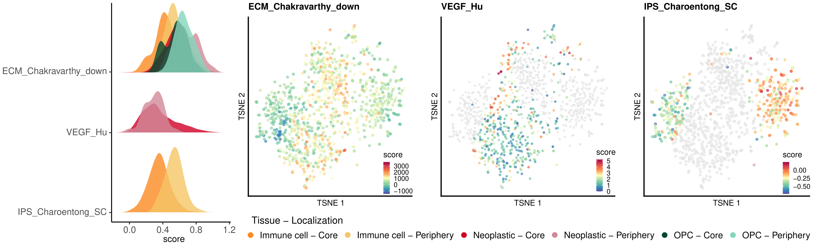
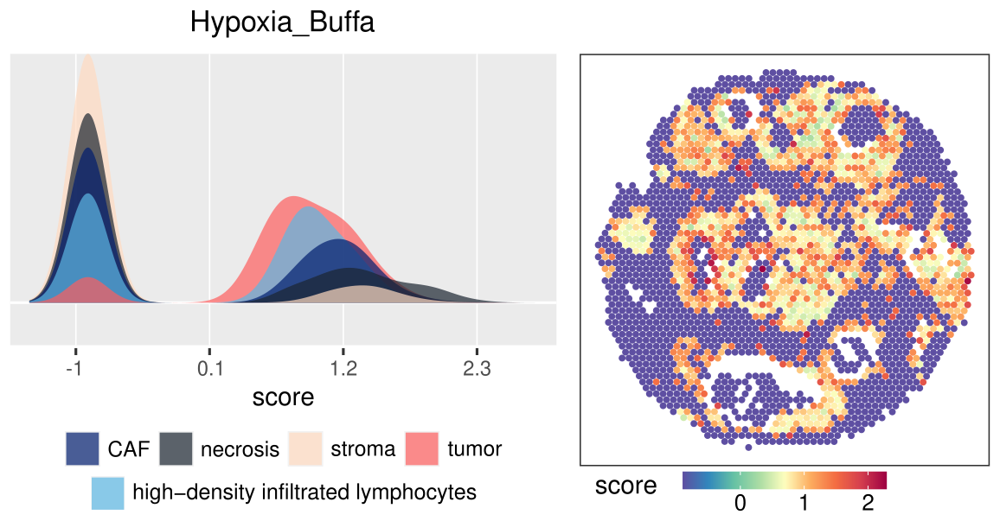

```{r setup, include=FALSE}
knitr::opts_chunk$set(echo = TRUE, fig.wide = TRUE)
```

# Introduction
In cancer studies, many works propose transcriptional signatures as good indicators of cancer processes, for their potential to show cancer ongoing activities and that can be used for patient stratification. For these reasons, they are considered potentially useful to guide therapeutic decisions and monitoring interventions. Moreover, transcriptional signatures of RNA-seq experiments are also used to assess the complex relations between the tumor and its microenvironment. In recent years, the new technologies for transcriptome detection (single-cell RNA-seq and spatial transcriptomics) highlighted the highly heterogeneous behaviour of this disease and, as a result, the need to dissect its complexity.

Each of these signatures has a specific gene set (and eventually a set of coefficients to differently weight the gene contributions) whose expression levels are combined in a single-sample score. And each signature has its own method to define the computation of the score. Despite much evidence that computational implementations are useful to improve data applicability and dissemination, the vast majority of signatures in literature are not published along with a computational code and only few of them have been implemented in a software, virtuous examples are: the R package `consensusOV`, dedicated to the TCGA ovarian cancer signature; and the R package `genefu` which hosts some of the most popular signatures of breast cancer.

`signifinder` provides an easy and fast computation of several published signatures. Firstly, users can see all the signatures collected so far in the package, with all the useful information and a description on how to properly interpret the scores. Then, users can decide which signature they want to compute on their dataset. To be easily integrated in the expression data analysis pipelines, `signifinder` works with the Bioconductor data structures (`SummarizedExperiment`, `SingleCellExperiment` and `SpatialExperiment`).

Also, several visualization functions are implemented to visualize the scores. These can help in the result interpretations: users can not only browse single signatures independently but also compare them with each other.

# Installation
To install this package:

```{r eval=FALSE}
if (!require("BiocManager", quietly = TRUE))
    install.packages("BiocManager")

BiocManager::install("signifinder")
```

# Criteria for signature inclusion

The criteria for the inclusion of the signatures are: (i) signatures should rely on cancer topics, and be developed and used on cancer samples; (ii) signatures must exclusively use transcriptomic data; (iii) the original paper must state the gene list used for the signature definition, where all genes have an official gene symbol (Hugo consortium) or an unambiguous translation (genes without an official gene symbol are removed); (iv) the method to calculate the score must be unambiguously described.
While it may not ever be possible to include all cancer signatures proposed in the literature, our package makes easy the addition of new signatures (by us or by others via “pull requests”, see [Adding new signatures](#adding-new-signatures)).

# How to use signifinder
## Input expression data
The input expression dataset must be normalized RNA-Seq counts (or normalized data matrix from microarrays) of bulk transcriptomics data, single-cell transcriptomics data or spatial transcriptomics data. They should be provided in the form of a matrix, a data frame or a `SummarizedExperiment` (and respectively `SingleCellExperiment`/`SpatialExperiment`) where rows correspond to genes and columns correspond to samples. In the last case, the name of the assay containing the normalized values should be "norm_expr" (users can also choose another name, but it should be specified in the `whichAssay` argument). Regardless the input type class, the output data is a `SummarizedExperiment` (`SingleCellExperiment`/`SpatialExperiment`) where the scores computed are put in the `colData` section.

Gene IDs in the input data can either be gene symbols, NCBI entrez or ensembl gene IDs. Users must say which of the three identifiers they use (SYMBOL, ENTREZID or ENSEMBL) to let the package convert the signature gene lists (`nametype` argument inside the signature functions).
When a signature is computed a message is shown that says the percentage of genes found in the input data compared to the original list. There is no minimum threshold of genes for signatures to be computed, but a `warning` will be given if there are less than the 30% of signature genes. After a signature has been calculated it is possible to visually inspect signature gene expressions using `geneHeatmapSignPlot` (see [Signature goodness](#signature-goodness)).

Furthermore, the original works also specify the type of expression value (e.g. normalized value, TPM (transcript per million), log(TPM), etc…) that should be used to compute the signature. Therefore, during signature computation, data type should be eventually converted as reported in the original work. When using `signifinder`, users must supply the input data in the form of *normalised counts* (or *normalised arrays*) and, for the signatures which require this, a data transformation step will be automatically performed. The transformed data matrix will be included in the output as an additional assay and the name of the assay will be the name of the conversion (i.e. “TPM”, “CPM” or “FPKM”). Alternatively, if the input data is a `SummarizedExperiment` object that already contains (in addition to the normalized count) also an assay of the transformed data, this will be used directly. Note that in order to be used they must be called “TPM”, “CPM” or “FPKM”. Finally, included signatures have been developed both from array and RNA-seq data, therefore it is crucially important for users to specify the type of input data: “microarray” or “rnaseq” (`inputType` argument inside the signature functions). In `signifinder`, signatures developed with microarray can be applied to RNA-seq data but not vice versa due to input type conversions.


## Computation of scores
In the following section, we use an example bulk expression dataset of ovarian cancer to show how to use `signifinder` with a standard workflow.

```{r, message=FALSE}
# loading packages
library(SummarizedExperiment)
library(signifinder)
library(dplyr)
data(ovse)
ovse
```

We can check all the signatures available in the package with the function `availableSignatures`.

```{r}
availSigns <- availableSignatures()
```

The function returns a data frame with all the signatures included in the package and for each signature the following information:

* signature: name of the signature
* scoreLabel: column name(s) of scores added inside `colData`
* functionName: name of the function to use to compute the signature
* topic: general cancer topic
* tumor: tumor type for which the signature was developed
* tissue: tumor tissue for which the signature was developed
* cellType: cell type for which the signature was developed
* requiredInput: tumor data with which the signature was developed
* transformationStep: data transformation step performed inside the function starting from the user's 'normArray' or 'normCounts' data
* author: first author of the work in which the signature is described
* reference: reference of the work
* description: brief description of the signature and how to evaluate its score

```{r echo=FALSE}
knitr::kable(t(availSigns[1,]))
```

We can also interrogate the table asking which signatures are available for a specific tissue (e.g. ovary).

```{r}
ovary_signatures <- availableSignatures(tissue = "ovary", description = FALSE)
```
```{r echo=FALSE}
knitr::kable(
    ovary_signatures, 
    caption = 'Signatures developed for ovary collected in signifinder.') %>% 
    kableExtra::kable_paper() %>% 
    kableExtra::scroll_box(width = "81%", height = "870px")
```

Once we have found a signature of interest, we can compute it by using the corresponding function (indicated in the `functionName` field of `availableSignatures` table). All the signature functions require the expression data and to indicate the type of input data (`inputType` equal to “rnaseq” or “microarray”). Data are supposed to be the normalized expression values.

```{r}
ovse <- ferroptosisSign(dataset = ovse, inputType = "rnaseq")
```

Some signatures are grouped in the same function by cancer topic even if they deal with different cancer types and computation approaches. We can unequivocally choose the one we are interested in by stating the first author of the signature (indicated in the `author` field of `availableSignatures` table). E.g., currently, there are four different epithelial-to-mesenchymal transition (EMT) signatures implemented inside the `EMTSign` function ("Miow", "Mak", "Cheng" or "Thompson"). We can choose which one to compute stating the `author` argument:

```{r}
ovse <- EMTSign(dataset = ovse, inputType = "rnaseq", author = "Miow")
```

In this way, "EMT_Miow" is computed. Regardless the expression input type, the output data of all the signature functions is a `SummarizedExperiment` with the computed signature scores in the `colData`. Thus, the returned object can be resubmitted as input data to another signature function and will be returned as well with the addition of the new signature in the `colData`.

We can also compute multiple signatures at once with the function `multipleSign`. We can specify which signatures we are interested in through the use of the arguments `tissue`, `tumor` and/or `topic` to define the signature list to compute. E.g. here below we compute all the available signature for ovary and pan-tissue:

```{r}
ovse <- multipleSign(dataset = ovse, inputType = "rnaseq",
                     tissue = c("ovary", "pan-tissue"))
```

Here below, instead, we compute all the available signature for ovary, pan-tissue and that are related to the immune system activity:

```{r}
ovse <- multipleSign(dataset = ovse, inputType = "rnaseq",
                     tissue = c("ovary", "pan-tissue"), 
                     topic = "immune system")
```

Alternatively, we can state exactly the signature names using the `whichSign` argument. 

```{r}
ovse <- multipleSign(dataset = ovse, inputType = "rnaseq",
                     whichSign = c("EMT_Miow", "IPSOV_Shen"))
```

## Signature goodness

When computing a signature on a dataset we always have to keep in mind that not all the signature genes may be present in the dataset. Also, these may have many zero values or other issues affecting the goodness of a specific signature for the dataset. We can inspect some signature's technical parameters to evaluate their reliability for the analysed dataset. First, users can access the complete gene list of a signature with the function `getSignGenes`, that returns a dataframe object with "SYMBOL" in the first column. Some signatures have also additional columns: "coeff" for coefficients that weigh the gene contributions; "class" for a classification that divides the signature in two or more groups. Few signatures have other specific columns.

```{r}
getSignGenes("VEGF_Hu")
getSignGenes("Pyroptosis_Ye")
getSignGenes("EMT_Thompson")
```

Second, the `evaluationSignPlot` function returns a multipanel plot that shows for each signature: (i) a value of the goodness of a signature for the user's dataset. This goes from 0, worst goodness, to 100, best goodness, and is a combination of the parameters shown in the other pannels; (ii) the percentage of genes from the signature gene list that are actually available in the dataset; (iii) the percentage of zero values in the signature genes, for each sample; (iv) the correlation between signature scores and the sample total read counts; (v) the correlation between signature scores and the percentage of the sample total zero values.

```{r fig.height=7, fig.width=12}
evaluationSignPlot(data = ovse)
```

Third, users may be also interested in visually exploring the expression values of the genes involved in a signature. In this case, we can use `geneHeatmapSignPlot` to visualize them. It generates a heatmap of the expression values with genes on the rows and samples on the columns.

```{r fig.height=3, fig.wide=FALSE}
geneHeatmapSignPlot(data = ovse, whichSign = "LipidMetabolism_Zheng", 
                    logCount = TRUE)
```

Further, the function is not restricted to the visualization of only one signature, and we can also plot the expression values of genes from multiple signatures, also evaluating the gene list intersections. Since each signature has its own method to compute the score then to plot several signatures together the scores are transformed into z-score, individually for each signature.

```{r}
set.seed(21)
geneHeatmapSignPlot(data = ovse, whichSign = c("IFN_Ayers", "Tinflam_Ayers"), 
                    logCount = TRUE)
```

## Visualization

### Score distribution plot
Each signature computed can be explored using the `oneSignPlot` function to visualize both the score and the density distribution.

```{r fig.wide=FALSE}
oneSignPlot(data = ovse, whichSign = "Hypoxia_Buffa")
```

### Score correlation plot
To easily investigate the relation across multiple signatures, `signifinder` provides a function to easily show the pairwise correlations of the signatures (`correlationSignPlot`). The `whichSign` argument could be set to specify which signatures should be plotted. When it is not stated all signatures are used. Green-blue colors represent anticorrelations while orange-red scale is for positive correlations. Then, signatures are clustered to group together higher related ones.

```{r}
sign_cor <- correlationSignPlot(data = ovse)
highest_correlated <- unique(unlist(
    sign_cor$data[(sign_cor$data$cor>0.95 & sign_cor$data$cor<1),c(1,2)]))
```

### Score heatmap
We can compare scores across different signatures with the `hetmapSignPlot` function. Since each signature has its own method to compute the score then to plot several signatures together the scores are transformed into z-score, individually for each signature. The `whichSign` argument could be set to specify which signatures should be plotted. When it is not stated all signatures are used.

```{r fig.height=8, fig.wide=FALSE}
heatmapSignPlot(data = ovse)
```

```{r fig.height=2.5, fig.wide=FALSE}
heatmapSignPlot(data = ovse, whichSign = highest_correlated)
```

Users may also be interested in seeing how signatures are sorted in relation to only one or few of them. In this case, we can pass one or few signatures to the `clusterBySign` argument that will be used to cluster samples.
Furthermore, users can add to the plot external sample annotations or plot the internal signature annotations ("signature", "topic", "tumor" or "tissue").

```{r fig.height=3.5}
set.seed(21)
heatmapSignPlot(data = ovse, whichSign = highest_correlated, 
                clusterBySign = paste0("ConsensusOV_Chen_", c("IMR","DIF","PRO","MES")),
                sampleAnnot = ovse$OV_subtype, signAnnot = "topic")
```

### Survival plot
Using the function `survivalSignPlot` we can test the association with survival of a signature. The function needs a data frame with the patient survival time data. `survivalSignPlot` uses a Kaplan-Meier curve to test if patients with high or low values of the signature have differences in survival time. Different cut points of the signature score can be indicated through the argument `cutpoint` to define the two patient groups.

```{r}
mysurvData <- cbind(ovse$os, ovse$status)
rownames(mysurvData) <- rownames(colData(ovse))
head(mysurvData)
```

```{r}
survivalSignPlot(data = ovse, survData = mysurvData, 
                 whichSign = "Pyroptosis_Ye", cutpoint = "optimal")
```

### Score ridgeline plot
Finally, we can plot ridge lines with one or multiple signatures, also grouping samples by external annotations if needed. Since each signature has its own method to compute the score then to plot several signatures together the scores are transformed into z-score, individually for each signature.

```{r}
ridgelineSignPlot(data = ovse, whichSign = highest_correlated)
ridgelineSignPlot(data = ovse, whichSign = highest_correlated, 
                  groupByAnnot = ovse$OV_subtype)
```

## Other examples
Here, we present the results obtained with other two example datasets; one for single-cell transcriptomics and one for spatial transcriptomics.

### Single-cell transcriptomics
We report here the results obtained using the single-cell transcriptomics dataset coming from a glioblastoma tissue of Darmanis et al. (GEO ID: GSE84465, Darmanis, S. et al. Single-Cell RNA-Seq Analysis of Infiltrating Neoplastic Cells at the Migrating Front of Human Glioblastoma. Cell Rep 21, 1399–1410 (2017)). We focused on the cells coming from the BT_S2 patient, that were labeled as immune cells, neoplastic or oligodendrocyte precursor cells (OPC) and that come from both the core and the periphery of the tumor.

We computed all the signatures for “brain” and “pan-tissue” that are available in signifinder running the command `multipleSign` setting `inputType = "rnaseq"` and `tissue = c("brain", "pan-tissue")`. Then, we performed a t-SNE and plotted the signature scores. Here, we can see the ridge plot and the t-SNE colored by some of the signatures computed, all cells or separately for different cell types.

```{r, echo=FALSE, out.width = "100%"}

# 
```

### Spatial transcriptomics
We used the spatial transcriptomic dataset “Human Breast Cancer: Ductal Carcinoma In Situ, Invasive Carcinoma (FFPE)”, included in the 10x Genomics Visium Spatial Gene Expression data, from the 10x website (https://www.10xgenomics.com). A manual annotation of the tissue area was performed and used to annotate the spots. We computed all the signatures for “breast” and “pan-tissue” cancers available in signifinder running the command `multipleSign` setting `inputType = "rnaseq"` and `tissue = c("breast", "pan-tissue")`. Here, we show the ridge plot and the spatial distribution of scores obtained for the Hipoxia_Buffa signature.

```{r, echo=FALSE, fig.wide=FALSE}

# 
```

# Adding new signatures
Please contact us if you have a gene expression signature that you would like to see added to the `signifinder` package. You can write us an email (stefania.pirrotta@phd.unipd.it) or open an issue in https://github.com/CaluraLab/signifinder/issues. The more difficult/custom the implementation, the better, as its inclusion in this package will provide more value for other users in the R/Bioconductor community.

# Session info
Here is the output of sessionInfo() on the system on which this document was compiled.

```{r}
sessionInfo()
```

